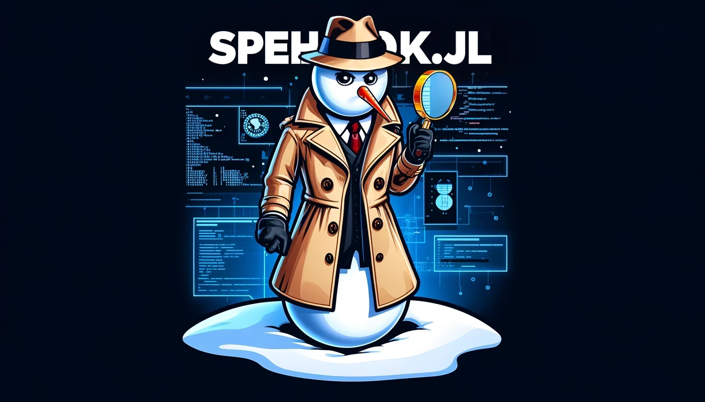

# Spehulak.jl 
[](https://svilupp.github.io/Spehulak.jl/stable/) 
[](https://svilupp.github.io/Spehulak.jl/dev/) 
[](https://github.com/svilupp/Spehulak.jl/actions/workflows/CI.yml?query=branch%3Amain) 
[](https://codecov.io/gh/svilupp/Spehulak.jl) 
[](https://github.com/JuliaTesting/Aqua.jl)




> [!WARNING]
> This package is still under development and is not yet ready for use.

Spehulak.jl is a package for GenAI observability - helping you understand what's happening inside your GenAI model. It provides a set of tools for inspecting and evaluating the traces saved via PromptingTools.jl.

## Quick Start

Run the file `main.jl`, eg, `julia --project -t auto main.jl`.

Open the browser and navigate to `http://localhost:8000`.

As an example, load the file `log/conversation...` in this folder.

## Frequently Asked Questions

**What can it do?**
Browse any serialized LLM conversations. If you used traced messages, we will display all the relevant metadata as well (model, templates, template versions, etc.).

**How to automatically save/log my LLM conversations?**
See [PromptingTools.jl docs](https://svilupp.github.io/PromptingTools.jl/dev/frequently_asked_questions#Automatic-Logging-/-Tracing)

Or generate a few toy examples
```julia
using PromptingTools
using PromptingTools: TracerSchema, SaverSchema, OpenAISchema, pprint

schema = OpenAISchema() |> TracerSchema |> SaverSchema

# Let's create a multi-turn conversation
conversation = aigenerate(schema,:JuliaExpertAsk; ask="Write a function to convert vector of strings into pig latin", model="gpt4o", return_all=true)
pprint(conversation)

# Let's create one more turn -- notice that we provide the past conversation as a kwarg
conversation = aigenerate(schema,"That's too complicated. Please simplify it. Think step by step first"; conversation, model="gpt4o", return_all=true)
pprint(conversation)

```

You should see a few files created in the folder `log/` - try opening them with Spehulak!

**What's Spehulak?**

"Špehulak" (pronounced "shpeh-hoo-lahk") blends "spy" and "snowman," riffing on the Czech words "špeh" for spy and "sněhulák" for snowman. It’s a fun name for an observability platform because it’s all about keeping a watchful eye, like a spy, while the snowman part plays into being cool under pressure as you sift through heaps of data plus being invisible/in the background, not being in the way. It’s perfect for diving deep into the inner workings of your LLM apps!